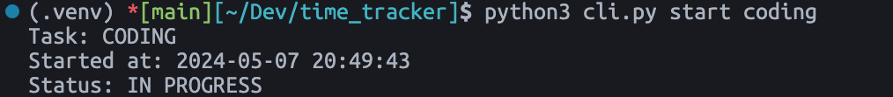
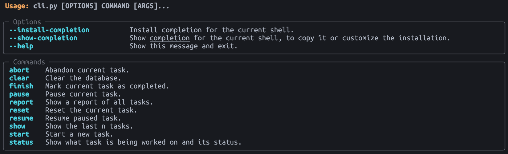

# Task Tracker
*Developed by: [Mavromatis, Nikolaos](mailto:nck.mavromatis@gmail.com)*

A CLI application to easily track tasks you're working on.

## Quick Setup
In a terminal, navigate to the directory where you want to clone this repository.
```bash
cd path/to/folder
```

Clone this repository.
```bash
git clone https://github.com/nikolaos-mavromatis/task-tracker.git
```

Move into the newly created directory, create a virtual environment and install required packages.
```bash
cd task-tracker
python3 -m venv .venv
source .venv/bin/activate
pip3 install -r requirements.txt
```

You can start issuing commands to the task tracker. For example, to start a coding task:
```bash
python3 cli.py start coding
```



For an overview of the available commands, run the following – see also image below.
```bash
python3 cli.py --help
```




